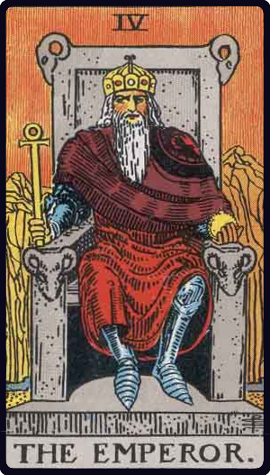

# O Imperador

*The Emperor*

## Waite — descrição e simbolismo

He has a form of the Crux ansata for his sceptre and a globe in his left hand. He is a crowned monarch— commanding, stately, seated on a throne, the arms of which axe fronted by rams' heads. He is executive and realization, the power of this world, here clothed with the highest of its natural attributes. He is occasionally represented as seated on a cubic stone, which, however, confuses some of the issues. He is the virile power, to which the Empress responds, and in this sense is he who seeks to remove the Veil of Isis; yet she remains virgo intacta. It should be understood that this card and that of the Empress do not precisely represent the condition of married life, though this state is implied. On the surface, as I have indicated, they stand for mundane royalty, uplifted on the seats of the mighty; but above this there is the suggestion of another presence. They signify also— and the male figure especially-the higher kingship, occupying the intellectual throne. Hereof is the lordship of thought rather than of the animal world. Both personalities, after their own manner, are "full of strange experience," but theirs is not consciously the wisdom which draws from a higher world. The Emperor has been described as (a) will in its embodied form, but this is only one of its applications, and (b) as an expression of virtualities contained in the Absolute Being— but this is fantasy.

## Waite — resumo

Stability, power, protection, realization; a great person; aid, reason, conviction; also authority and will. Reversed : Benevolence, compassion, credit; also confusion to enemies, obstruction, immaturity.

---

*Fontes: A. E. Waite, The Pictorial Key to the Tarot (1911), domínio público.*
