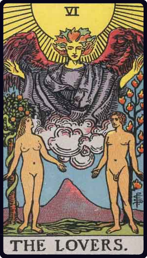

# Os Enamorados

*The Lovers*

## Waite — descrição e simbolismo

THfc LOVERS. The sun shines in the zenith, and beneath is a great winged figure with arms extended, pouring down influences. In the foreground are two human figures, male and female, unveiled before each other, as if Adam and Eve when they first occupied the paradise of the earthly body. Behind the man is the Tree of Life, bearing twelve fruits, and the Tree of the Knowledge of Good and Evil is behind the woman; the serpent is twining round it. The figures suggest youth, virginity, innocence and love before it is contaminated by gross material desire. This is in all simplicity the card of human love, here exhibited as part of the way, the truth and the life. It replaces, by recourse to first principles, the old card of marriage, which I have described previously, and the later follies which depicted man between vice and virtue. In a very high sense, the card is a mystery of the Covenant and Sabbath. The suggestion in respect of the woman is that she signifies that attraction towards the sensitive life which carries within it the idea of the Fall of Man, but she is rather the working of a Secret Law of Providence than a willing and conscious temptress. It is through her imputed lapse that man shall arise ultimately, and only by her can he complete himself. The card is therefore in its way another intimation concerning the great mystery of womanhood. The old meanings fall to pieces of necessity with the old pictures, but even as interpretations of the latter, some of them were of the order of commonplace and others were false in symbolism.

## Waite — resumo

Attraction, love, beauty, trials overcome. Reversed : Failure, foolish designs. Another account speaks of marriage frustrated and contrarieties of all kinds.

---

*Fontes: A. E. Waite, The Pictorial Key to the Tarot (1911), domínio público.*
