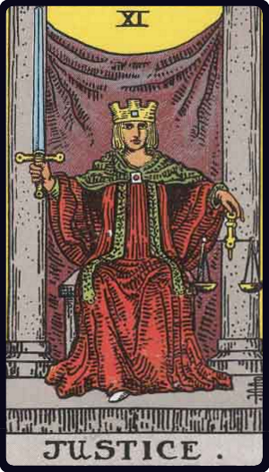

# A Justiça

*Justice*

## Waite — descrição e simbolismo

As this card follows the traditional symbolism and carries above all its obvious meanings, there is little to say regarding it outside the few considerations collected in the first part, to which the reader is referred. It will be seen, however, that the figure is seated between pillars, like the High Priestess, and on this account it seems desirable to indicate that the moral principle which deals unto every man according to his works— while, of course, it is in strict analogy with higher things ;-differs in its essence from the spiritual justice which is involved in the idea of election. The latter belongs to a mysterious order of Providence, in virtue of which it is possible for certain men to conceive the idea of dedication to the highest things. The operation of this is like the breathing of the Spirit where it wills, and we have no canon of criticism or ground of explanation concerning it. It is analogous to the possession of the fairy gifts and the high gifts and the gracious gifts of the poet: we have them or have not, and their presence is as much a mystery as their absence. The law of Justice is not however involved by either alternative. In conclusion, the pillars of Justice open into one world and the pillars of the High Priestess into another.

## Waite — resumo

Equity, rightness, probity, executive; triumph of the deserving side in law. Reversed: Law in all its departments, legal complications, bigotry, bias, excessive severity.

---

*Fontes: A. E. Waite, The Pictorial Key to the Tarot (1911), domínio público.*
