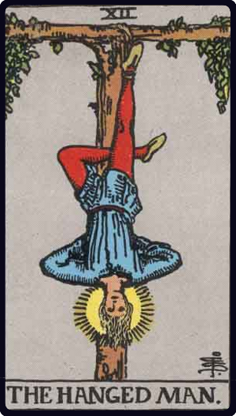

# O Enforcado

*The Hanged Man*

## Waite — descrição e simbolismo

The gallows from which he is suspended forms a Tau cross, while the figure— from the position of the legs-forms a fylfot cross. There is a nimbus about the head of the seeming martyr. It should be noted (1) that the tree of sacrifice is living wood, with leaves thereon; (2) that the face expresses deep entrancement, not suffering; (3) that the figure, as a whole, suggests life in suspension, but life and not death. It is a card of profound significance, but all the significance is veiled. One of his s editors suggests that Eliphas Levi did not know the meaning, which is unquestionable nor did the editor himself. It has been called falsely a card of martyrdom, a card a of prudence, a card of the Great Work, a card of duty; but we may exhaust all published interpretations and find only vanity. I will say very simply on my own part that it expresses the relation, in one of its aspects, between the Divine and the Universe. He who can understand that the story of his higher nature is imbedded in this symbolism will receive intimations concerning a great awakening that is possible, and will know that after the sacred Mystery of Death there is a glorious Mystery of Resurrection.

## Waite — resumo

Wisdom, circumspection, discernment, trials, sacrifice, intuition, divination, prophecy. Reversed: Selfishness, the crowd, body politic.

---

*Fontes: A. E. Waite, The Pictorial Key to the Tarot (1911), domínio público.*
