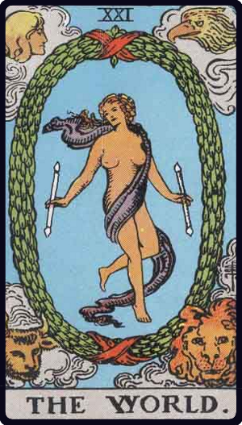

# O Mundo

*The World*

## Waite — descrição e simbolismo

As this final message of the Major Trumps is unchanged— and indeed unchangeable— in respect of its design, it has been partly described already regarding its deeper sense. It represents also the perfection and end of the Cosmos, the secret which is within it, the rapture of the universe when it understands itself in God. It is further the state of the soul in the consciousness of Divine Vision, reflected from the self-knowing spirit. But these meanings are without prejudice to that which I have said concerning it on the material side. It has more than one message on the macrocosmic side and is, for example, the state of the restored world when the law of manifestation shall have been carried to the highest degree of natural perfection. But it is perhaps more especially a story of the past, referring to that day when all was declared to be good, when the morning stars sang together and all the Sons of God shouted for joy. One of the worst explanations concerning it is that the figure symbolizes the Magus when he has reached the highest degree of initiation; another account says that it represents the absolute, which is ridiculous. The figure has been said to stand for Truth, which is, however, more properly allocated to the seventeenth card. Lastly, it has been called the Crown of the Magi.

2.3 Conclusion as to the Greater Keys

## Waite — resumo

Assured success, recompense, voyage, route, emigration, flight, change of place. Reversed: Inertia, fixity, stagnation, permanence. It will be seen that, except where there is an irresistible suggestion conveyed by the surface meaning, that which is extracted from the Trumps Major by the divinatory art is at once artificial and arbitrary, as it seems to me, in the highest degree. But of one order are the mysteries of light and of another are those of fantasy. The allocation of a fortune-telling aspect to these cards is the story of a prolonged impertinence. 3.4 Some Additional Meanings of the Lesser Arcana

---

*Fontes: A. E. Waite, The Pictorial Key to the Tarot (1911), domínio público.*
