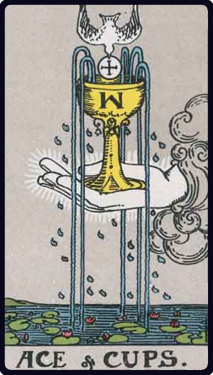

# Ás de Copas

*Ace of Cups*

## Waite — descrição e simbolismo

The waters are beneath, and thereon are water-lilies; the hand issues from the cloud, holding in its palm the cup, from which four streams are pouring; a dove, bearing in its bill a cross-marked Host, descends to place the Wafer in the Cup; the dew of water is falling on all sides. It is an intimation of that which may lie behind the Lesser Arcana.

## Waite — significados

House of the true heart, joy, content, abode, nourishment, abundance, fertility; Holy Table, felicity hereof.

## Waite — invertida

House of the false heart, mutation, instability, revolution.

---

*Fontes: A. E. Waite, The Pictorial Key to the Tarot (1911), domínio público.*
