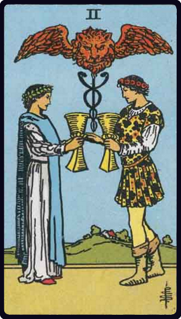

# Dois de Copas

*Two of Cups*

## Waite — descrição e simbolismo

A youth and maiden are pledging one another, and above their cups rises the Caduceus of Hermes, between the great wings of which there appears a lion's head. It is a variant of a sign which is found in a few old examples of this card. Some curious emblematical meanings are attached to it, but they do not concern us in this place.

## Waite — significados

Love, passion, friendship, affinity, union, concord, sympathy, the interrelation of the sexes, and— as a suggestion apart from all offices of divination- that desire which is not in Nature, but by which Nature is sanctified.

---

*Fontes: A. E. Waite, The Pictorial Key to the Tarot (1911), domínio público.*
