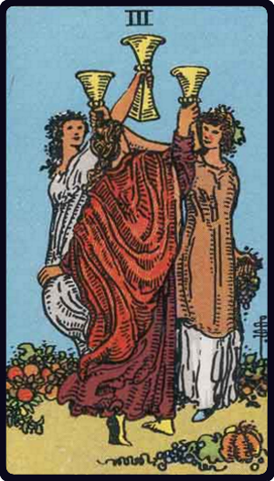

# Três de Copas

*Three of Cups*

## Waite — descrição e simbolismo

Maidens in a garden-ground with cups uplifted, as if pledging one another.

## Waite — significados

The conclusion of any matter in plenty, perfection and merriment; happy issue, victory, fulfilment, solace, healing,

## Waite — invertida

Expedition, dispatch, achievement, end. It signifies also the side of excess in physical enjoyment, and the pleasures of the senses.

---

*Fontes: A. E. Waite, The Pictorial Key to the Tarot (1911), domínio público.*
