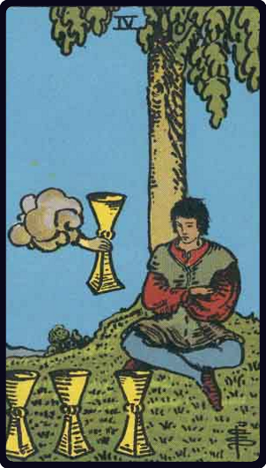

# Quatro de Copas

*Four of Cups*

## Waite — descrição e simbolismo

A young man is seated under a tree and contemplates three cups set on the grass before him; an arm issuing from a cloud offers him another cup. His expression notwithstanding is one of discontent with his environment.

## Waite — significados

Weariness, disgust, aversion, imaginary vexations, as if the wine of this world had caused satiety only; another wine, as if a fairy gift, is now offered the wastrel, but he sees no consolation therein. This is also a card of blended pleasure.

## Waite — invertida

Novelty, presage, new instruction, new relations.

---

*Fontes: A. E. Waite, The Pictorial Key to the Tarot (1911), domínio público.*
