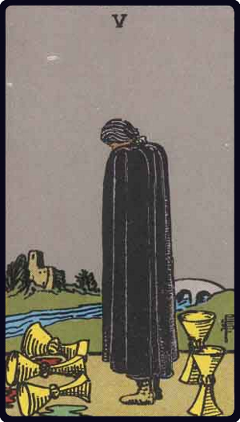

# Cinco de Copas

*Five of Cups*

## Waite — descrição e simbolismo

A dark, cloaked figure, looking sideways at three prone cups two others stand upright behind him; a bridge is in the background, leading to a small keep or holding. Divanatory Meanings: It is a card of loss, but something remains over; three have been taken, but two are left; it is a card of inheritance, patrimony, transmission, but not corresponding to expectations; with some interpreters it is a card of marriage, but not without bitterness or frustration.

## Waite — invertida

News, alliances, affinity, consanguinity, ancestry, return, false projects.

---

*Fontes: A. E. Waite, The Pictorial Key to the Tarot (1911), domínio público.*
