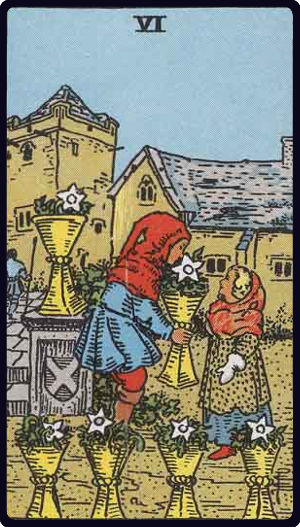

# Seis de Copas

*Six of Cups*

## Waite — descrição e simbolismo

Children in an old garden, their cups filled with flowers.

## Waite — significados

A card of the past and of memories, looking back, as— for example— on childhood; happiness, enjoyment, but coming rather from the past; things that have vanished. Another reading reverses this, giving new relations, new knowledge, new environment, and then the children are disporting in an unfamiliar precinct. Reversed l: The future, renewal, that which will come to pass presently.

---

*Fontes: A. E. Waite, The Pictorial Key to the Tarot (1911), domínio público.*
