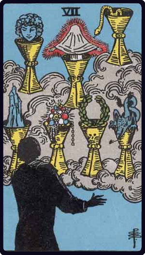

# Sete de Copas

*Seven of Cups*

## Waite — descrição e simbolismo

Strange chalices of vision, but the images are more especially those of the fantastic spirit.

## Waite — significados

Fairy favours, images of reflection, sentiment, imagination, things seen in the glass of contemplation; some attainment in these degrees, but nothing permanent or substantial is suggested.

## Waite — invertida

Desire, will, determination, project.

---

*Fontes: A. E. Waite, The Pictorial Key to the Tarot (1911), domínio público.*
