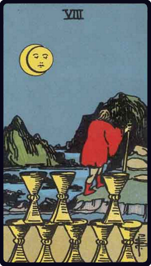

# Oito de Copas

*Eight of Cups*

## Waite — descrição e simbolismo

A man of dejected aspect is deserting the cups of his felicity, enterprise, undertaking or previous concern.

## Waite — significados

The card speaks for itself on the surface, but other readings are entirely antithetical— giving joy, mildness, timidity, honour, modesty. In practice, it is usually found that the card shews the decline of a matter, or that a matter which has been thought to be important is really of slight consequence— either for good or evil.

## Waite — invertida

Great joy, happiness, feasting.

---

*Fontes: A. E. Waite, The Pictorial Key to the Tarot (1911), domínio público.*
