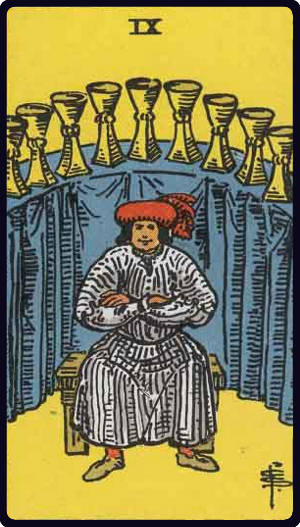

# Nove de Copas

*Nine of Cups*

## Waite — descrição e simbolismo

A goodly personage has feasted to his heart's content, and abundant refreshment of wine is on the arched counter behind him, seeming to indicate that the future is also assured. The picture offers the material side only, but there are other aspects.

## Waite — significados

Concord, contentment, physical bien-etre\ also victory, success, advantage; satisfaction for the Querent or person for whom the consultation is made.

## Waite — invertida

Truth, loyalty, liberty; but the readings vary and include mistakes, imperfections, etc.

---

*Fontes: A. E. Waite, The Pictorial Key to the Tarot (1911), domínio público.*
