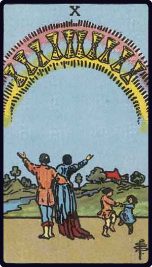

# Dez de Copas

*Ten of Cups*

## Waite — descrição e simbolismo

Appearance of Cups in a rainbow; it is contemplated in wonder and ecstacy by a man and woman below, evidently husband and wife. His right arm is about her; his left is raised upward; she raises her right arm. The two children dancing near them have not observed the prodigy but are happy after their own manner. There is a home-scene beyond.

## Waite — significados

Contentment, repose of the entire heart; the perfection of that state; also perfection of human love and friendship; if with several picture-cards, a person who is taking charge of the Querent's interests; also the town, village or country inhabited by the Querent.

## Waite — invertida

Repose of the false heart, indignation, violence.

---

*Fontes: A. E. Waite, The Pictorial Key to the Tarot (1911), domínio público.*
