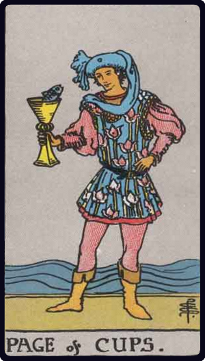

# Valete de Copas

*Page of Cups*

## Waite — descrição e simbolismo

PACE dj CUP 5, A fair, pleasing, somewhat effeminate page, of studious and intent aspect, contemplates a fish rising from a cup to look at him. It is the pictures of the mind taking form.

## Waite — significados

Fair young man, one impelled to render service and with whom the Querent will be connected; a studious youth; news, message; application, reflection, meditation; also these things directed to business.

## Waite — invertida

Taste, inclination, attachment, seduction, deception, artifice.

---

*Fontes: A. E. Waite, The Pictorial Key to the Tarot (1911), domínio público.*
