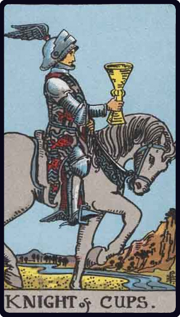

# Cavaleiro de Copas

*Knight of Cups*

## Waite — descrição e simbolismo

Graceful, but not warlike; riding quietly, wearing a winged helmet, referring to those higher graces of the imagination which sometimes characterize this card. He too is a dreamer, but the images of the side of sense haunt him in his vision.

## Waite — significados

Arrival, approach— sometimes that of a messenger; advances, proposition, demeanour, invitation, incitement.

## Waite — invertida

Trickery, artifice, subtlety, swindling, duplicity, fraud.

---

*Fontes: A. E. Waite, The Pictorial Key to the Tarot (1911), domínio público.*
