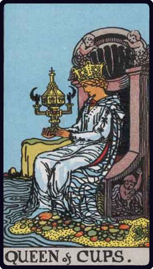

# Rainha de Copas

*Queen of Cups*

## Waite — descrição e simbolismo

Beautiful, fair, dreamy— as one who sees visions in a cup. This is, however, only one of her aspects; she sees, but she also acts, and her activity feeds her dream.

## Waite — significados

Good, fair woman; honest, devoted woman, who will do service to the Querent; loving intelligence, and hence the gift of vision; success, happiness, pleasure; also wisdom, virtue; a perfect spouse and a good mother.

## Waite — invertida

The accounts vary; good woman; otherwise, distinguished woman but one not to be trusted; perverse woman; vice, dishonour, depravity.

---

*Fontes: A. E. Waite, The Pictorial Key to the Tarot (1911), domínio público.*
