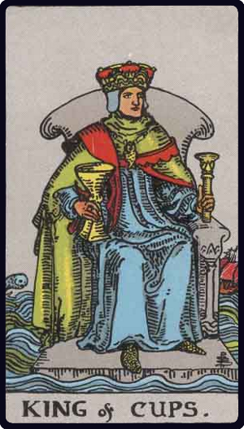

# Rei de Copas

*King of Cups*

## Waite — descrição e simbolismo

He holds a short sceptre in his left hand and a great cup in his right; his throne is set upon the sea; on one side a ship is riding and on the other a dolphin is leaping. The implicit is that the Sign of the Cup naturally refers to water, which appears in all the court cards.

## Waite — significados

Fair man, man of business, law, or divinity; responsible, disposed to oblige the Querent; also equity, art and science, including those who profess science, law and art; creative intelligence.

## Waite — invertida

Dishonest, double-dealing man; roguery, exaction, injustice, vice, scandal, pillage, considerable loss.

---

*Fontes: A. E. Waite, The Pictorial Key to the Tarot (1911), domínio público.*
