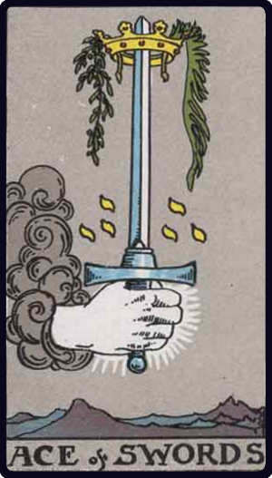

# Ás de Espadas

*Ace of Swords*

## Waite — descrição e simbolismo

A hand issues from a cloud, grasping as word, the point of which is encircled by a crown.

## Waite — significados

Triumph, the excessive degree in everything, conquest, triumph of force. It is a card of great force, in love as well as in hatred. The crown may carry a much higher significance than comes usually within the sphere of fortune-telling.

## Waite — invertida

The same, but the results are disastrous; another account says— conception, childbirth, augmentation, multiplicity.

## Waite — resumo

Great prosperity or great misery. Reversed. Marriage broken off, for a woman, through her own imprudence.

---

*Fontes: A. E. Waite, The Pictorial Key to the Tarot (1911), domínio público.*
