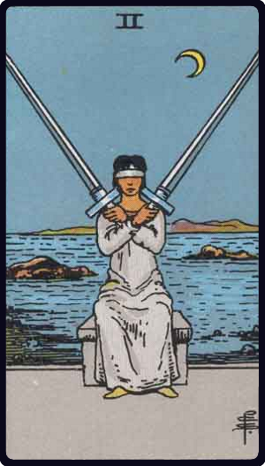

# Dois de Espadas

*Two of Swords*

## Waite — descrição e simbolismo

A hoodwinked female figure balances two swords upon her shoulders.

## Waite — significados

Conformity and the equipoise which it suggests, courage, friendship, concord in a state of arms; another reading gives tenderness, affection, intimacy. The suggestion of harmony and other favourable readings must be considered in a qualified manner, as Swords generally are not symbolical of beneficent forces in human affairs.

## Waite — invertida

Imposture, falsehood, duplicity, disloyalty.

## Waite — resumo

Gifts for a lady, influential protection for a man in search of help. Reversed: Dealings with 3.4 Some Additional Meanings of the Lesser Arcana

---

*Fontes: A. E. Waite, The Pictorial Key to the Tarot (1911), domínio público.*
