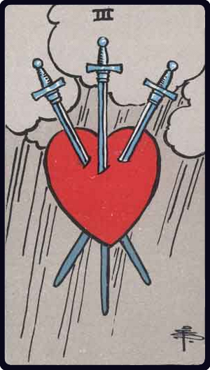

# Três de Espadas

*Three of Swords*

## Waite — descrição e simbolismo

Three swords piercing a heart; cloud and rain behind.

## Waite — significados

Removal, absence, delay, division, rupture, dispersion, and all that the design signifies naturally, being too simple and obvious to call for specific enumeration.

## Waite — invertida

Mental alienation, error, loss, distraction, disorder, confusion.

## Waite — resumo

For a woman, the flight of her lover. Reversed: A meeting with one whom the Querent has compromised; also a nun.

---

*Fontes: A. E. Waite, The Pictorial Key to the Tarot (1911), domínio público.*
