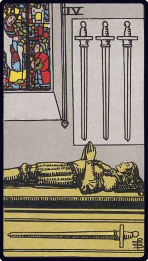

# Quatro de Espadas

*Four of Swords*

## Waite — descrição e simbolismo

The effigy of a knight in the attitude of prayer, at full length upon his tomb.

## Waite — significados

Vigilance, retreat, solitude, hermit's repose, exile, tomb and coffin. It is these last that have suggested the design.

## Waite — invertida

Wise administration, circumspection, economy, avarice, precaution, testament.

## Waite — resumo

A bad card, but if reversed a qualified success may be expected by wise administration of affairs. Reversed: A certain success following wise administration.

---

*Fontes: A. E. Waite, The Pictorial Key to the Tarot (1911), domínio público.*
