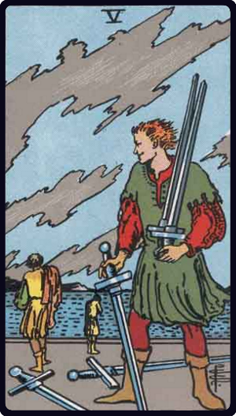

# Cinco de Espadas

*Five of Swords*

## Waite — descrição e simbolismo

A disdainful man looks after two retreating and dejected figures. Their swords lie upon the ground. He carries two others on his left shoulder, and a third sword is in his right hand, point to earth. He is the master in possession of the field.

## Waite — significados

Degradation, destruction, revocation, infamy, dishonour, loss, with the variants and analogues of these.

## Waite — invertida

The same; burial and obsequies.

## Waite — resumo

An attack on the fortune of the Querent. Reversed: A sign of sorrow and mourning.

---

*Fontes: A. E. Waite, The Pictorial Key to the Tarot (1911), domínio público.*
