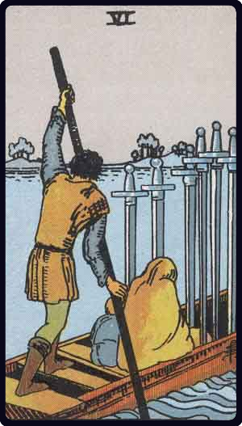

# Seis de Espadas

*Six of Swords*

## Waite — descrição e simbolismo

A ferryman carrying passengers in his punt to the further shore. The course is smooth, and seeing that the freight is light, it may be noted that the work is not beyond his strength.

## Waite — significados

journey by water, route, way, envoy, commissionary, expedient.

## Waite — invertida

Declaration, confession, publicity; one account says that it is a proposal of love.

---

*Fontes: A. E. Waite, The Pictorial Key to the Tarot (1911), domínio público.*
