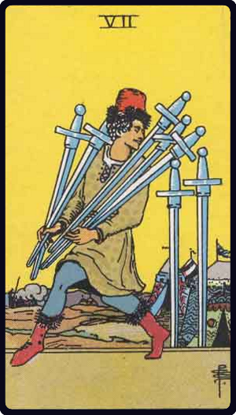

# Sete de Espadas

*Seven of Swords*

## Waite — descrição e simbolismo

A man in the act of carrying away five swords rapidly; the two others of the card remain stuck in the ground. A camp is close at hand.

## Waite — significados

Design, attempt, wish, hope, confidence; also quarrelling, a plan that may fail, annoyance. The design is uncertain in its import, because the significations are widely at variance with each other.

## Waite — invertida

Good advice, counsel, instruction, slander, babbling.

## Waite — resumo

Dark girl; a good card; it promises a country life after a competence has been secured. Reversed: Good advice, probably neglected. 57v.-The voyage will be pleasant. Reversed: Unfavourable issue of lawsuit.

---

*Fontes: A. E. Waite, The Pictorial Key to the Tarot (1911), domínio público.*
