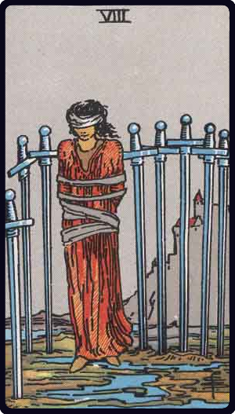

# Oito de Espadas

*Eight of Swords*

## Waite — descrição e simbolismo

A woman, bound and hoodwinked, with the swords of the card about her. Y et it is rather a card of temporary durance than of irretrievable bondage.

## Waite — significados

Bad news, violent chagrin, crisis, censure, power in trammels, conflict, calumny; also sickness.

## Waite — invertida

Disquiet, difficulty, opposition, accident, treachery; what is unforeseen; fatality.

## Waite — resumo

For a woman, scandal spread in her respect. Reversed: Departure of a relative.

---

*Fontes: A. E. Waite, The Pictorial Key to the Tarot (1911), domínio público.*
