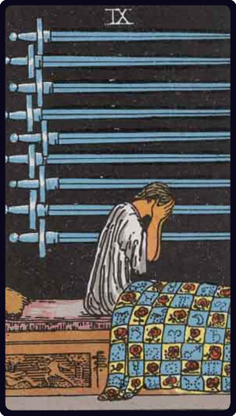

# Nove de Espadas

*Nine of Swords*

## Waite — descrição e simbolismo

One seated on her couch in lamentation, with the swords over her. She is as one who knows no sorrow which is like unto hers. It is a card of utter desolation.

## Waite — significados

Death, failure, miscarriage, delay, deception, disappointment, despair.

## Waite — invertida

Imprisonment, suspicion, doubt, reasonable fear, shame.

## Waite — resumo

An ecclesiastic, a priest; generally, a card of bad omen. Reversed: Good ground for suspicion against a doubtful person.

---

*Fontes: A. E. Waite, The Pictorial Key to the Tarot (1911), domínio público.*
