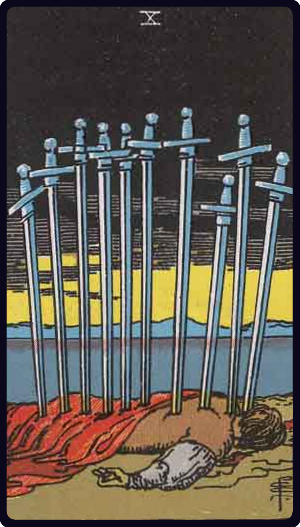

# Dez de Espadas

*Ten of Swords*

## Waite — descrição e simbolismo

A prostrate figure, pierced by all the swords belonging to the card.

## Waite — significados

Whatsoever is intimated by the design; also pain, affliction, tears, sadness, desolation. It is not especially a card of violent death.

## Waite — invertida

Advantage, profit, success, favour, but none of these are permanent; also power and authority.

---

*Fontes: A. E. Waite, The Pictorial Key to the Tarot (1911), domínio público.*
