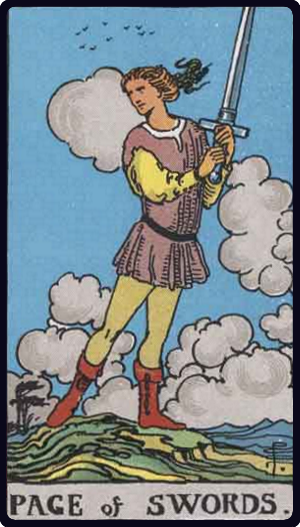

# Valete de Espadas

*Page of Swords*

## Waite — descrição e simbolismo

A lithe, active figure holds a sword upright in both hands, while in the act of swift walking. He is passing over rugged land, and about his way the clouds are collocated wildly. He is alert and lithe, looking this way and that, as if an expected enemy might appear at any moment.

## Waite — significados

Authority, overseeing, secret service, vigilance, spying, examination, and the qualities thereto belonging.

## Waite — invertida

More evil side of these qualities; what is unforeseen, unprepared state; sickness is also intimated.

## Waite — resumo

An indiscreet person will pry into the Querent's secrets. Reversed: Astonishing news. Fen.— Followed by Ace and King, imprisonment; for girl or wife, treason on the part of friends. Reversed: Victory and consequent fortune for a soldier in war.

---

*Fontes: A. E. Waite, The Pictorial Key to the Tarot (1911), domínio público.*
