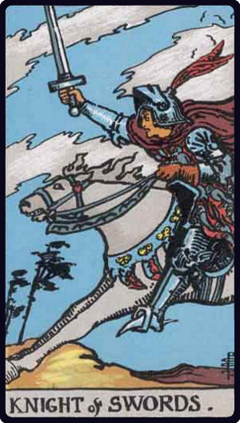

# Cavaleiro de Espadas

*Knight of Swords*

## Waite — descrição e simbolismo

He is riding in full course, as if scattering his enemies. In the design he is really a prototypical hero of romantic chivalry. He might almost be Galahad, whose sword is swift and sure because he is clean of heart.

## Waite — significados

Skill, bravery, capacity, defence, address, enmity, wrath, war, destruction, opposition, resistance, ruin. There is therefore a sense in which the card signifies death, but it carries this meaning only in its proximity to other cards of fatality.

## Waite — invertida

Imprudence, incapacity, extravagance.

## Waite — resumo

A soldier, man of arms, satellite, stipendiary; heroic action predicted for soldier. Reversed: Dispute with an imbecile person; for a woman, struggle with a rival, who will be conquered.

---

*Fontes: A. E. Waite, The Pictorial Key to the Tarot (1911), domínio público.*
