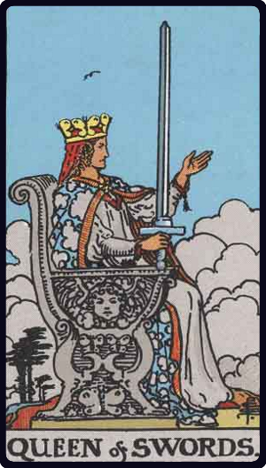

# Rainha de Espadas

*Queen of Swords*

## Waite — descrição e simbolismo

Her right hand raises the weapon vertically and the hilt rests on an arm of her royal chair the left hand is extended, the arm raised her countenance is severe but chastened; it suggests familiarity with sorrow. It does not represent mercy, and, her sword notwithstanding, she is scarcely a symbol of power.

## Waite — significados

Widowhood, female sadness and embarrassment, absence, sterility, mourning, privation, separation.

## Waite — invertida

Malice, bigotry, artifice, prudery, bale, deceit.

## Waite — resumo

A widow. Reversed: A bad woman, with ill-will towards the Querent.

---

*Fontes: A. E. Waite, The Pictorial Key to the Tarot (1911), domínio público.*
