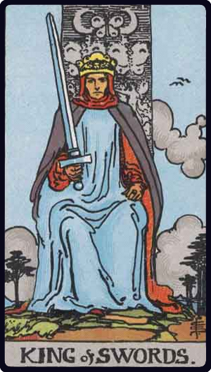

# Rei de Espadas

*King of Swords*

## Waite — descrição e simbolismo

He sits in judgment, holding the unsheathed sign of his suit. He recalls, of course, the conventional Symbol of justice in the Trumps Major, and he may represent this virtue, but he is rather the power of life and death, in virtue of his office.

## Waite — significados

Whatsoever arises out of the idea of judgment and all its connexions-power, command, authority, militant intelligence, law, offices of the crown, and so forth.

## Waite — invertida

Cruelty, perversity, barbarity, perfidy, evil intention.

## Waite — resumo

A lawyer, senator, doctor. Reversed: A bad man; also a caution to put an end to a ruinous lawsuit.

---

*Fontes: A. E. Waite, The Pictorial Key to the Tarot (1911), domínio público.*
