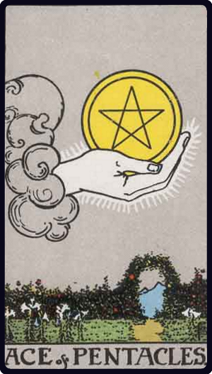

# Ás de Ouros

*Ace of Pentacles*

## Waite — descrição e simbolismo

A hand— issuing, as usual, from a cloud— holds up a pentacle.

## Waite — significados

Perfect contentment, felicity, ecstasy; also speedy intelligence; gold.

## Waite — invertida

The evil side of wealth, bad intelligence; also great riches. In any case it shews prosperity, comfortable material conditions, but whether these are of advantage to the possessor will depend on whether the card is reversed or not.

3.3 The Greater Arcana and their Divinatory Meanings

## Waite — resumo

The most favourable of all cards. Reversed. A share in the finding of treasure. It will be observed (1) that these adclitamenta have little connexion with the pictorial designs of the cards to which they refer, as these correspond with the more important speculative values; (2) and further that the additional meanings are very often in disagreement with those previously given. All meanings are largely independent of one another and all are reduced, accentuated or subject to modification and sometimes almost reversal by their place in a sequence. There is scarcely any canon of criticism in matters of this kind. I suppose that in proportion as any system descends from generalities to details it becomes naturally the more precarious; and in the records of professional fortune-telling, it offers more of the dregs and lees of the subject. At the same time, divinations based on intuition and second sight are of little practical value unless they come down from the region of universals to that of particulars; but in proportion as this gift is present in a particular case, the specific meanings recorded by past cartomancists will be disregarded in favour of the personal appreciation of card values. This has been intimated already. It seems necessary to add the following speculative readings. 3.5 The Recurrence of Cards in Dealing

---

*Fontes: A. E. Waite, The Pictorial Key to the Tarot (1911), domínio público.*
