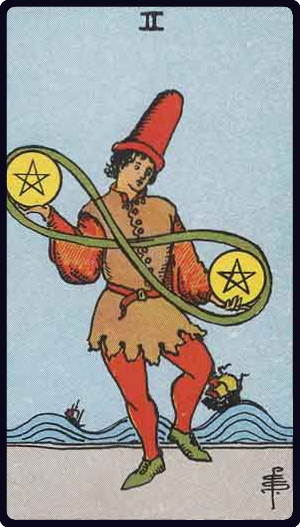

# Dois de Ouros

*Two of Pentacles*

## Waite — descrição e simbolismo

A young man, in the act of dancing, has a pentacle in either hand, and they are joined by that endless cord which is like the number 8 reversed.

## Waite — significados

On the one hand it is represented as a card of gaiety, recreation and its connexions, which is the subject of the design; but it is read also as news and messages in writing, as obstacles, agitation, trouble, embroilment.

## Waite — invertida

Enforced gaiety, simulated enjoyment, literal sense, handwriting, composition, letters of exchange.

## Waite — resumo

Troubles are more imaginary than real. Reversed. Bad omen, ignorance, injustice.

---

*Fontes: A. E. Waite, The Pictorial Key to the Tarot (1911), domínio público.*
