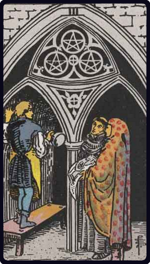

# Três de Ouros

*Three of Pentacles*

## Waite — descrição e simbolismo

A sculptor at his work in a monastery. Compare the design which illustrates the Eight of Pentacles. The apprentice or amateur therein has received his reward and is now at work in earnest.

## Waite — significados

Metier, trade, skilled labour; usually, however, regarded as a card of nobility, aristocracy, renown, glory.

## Waite — invertida

Mediocrity, in work and otherwise, puerility, pettiness, weakness.

## Waite — resumo

If for a man, celebrity for his eldest son. Reversed. Depends on neighbouring cards.

---

*Fontes: A. E. Waite, The Pictorial Key to the Tarot (1911), domínio público.*
