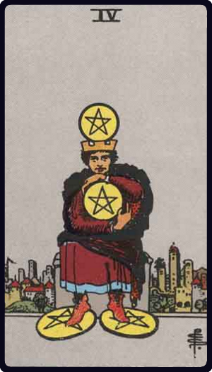

# Quatro de Ouros

*Four of Pentacles*

## Waite — descrição e simbolismo

A crowned figure, having a pentacle over his crown, clasps another with hands and arms; two pentacles are under his feet. He holds to that which he has.

## Waite — significados

The surety of possessions, cleaving to that which one has, gift, legacy, inheritance.

## Waite — invertida

Suspense, delay, opposition.

## Waite — resumo

For a bachelor, pleasant news from a lady. Reversed. Observation, hindrances.

---

*Fontes: A. E. Waite, The Pictorial Key to the Tarot (1911), domínio público.*
