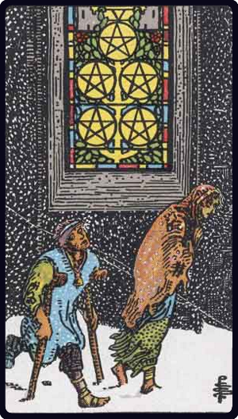

# Cinco de Ouros

*Five of Pentacles*

## Waite — descrição e simbolismo

Two mendicants in a snow-storm pass a lighted casement.

## Waite — significados

The card foretells material trouble above all, whether in the form illustrated— that is, destitution— or otherwise. For some cartomancists, it is a card of love and lovers-wife, husband, friend, mistress; also concordance, affinities. These alternatives cannot be harmonized.

## Waite — invertida

Disorder, chaos, ruin, discord, profligacy.

## Waite — resumo

Conquest of fortune by reason. Reversed. Troubles in love.

---

*Fontes: A. E. Waite, The Pictorial Key to the Tarot (1911), domínio público.*
