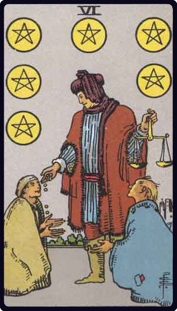

# Seis de Ouros

*Six of Pentacles*

## Waite — descrição e simbolismo

A person in the guise of a merchant weighs money in a pair of scales and distributes it to the needy and distressed. It is a testimony to his own success in life, as well as to his goodness of heart.

## Waite — significados

Presents, gifts, gratification another account says attention, vigilance now is the accepted time, present prosperity, etc.

## Waite — invertida

Desire, cupidity, envy, jealousy, illusion.

## Waite — resumo

The present must not be relied on. Reversed. A check on the Querent's ambition.

---

*Fontes: A. E. Waite, The Pictorial Key to the Tarot (1911), domínio público.*
