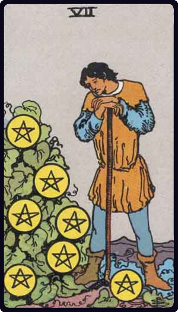

# Sete de Ouros

*Seven of Pentacles*

## Waite — descrição e simbolismo

A young man, leaning on his staff, looks intently at seven pentacles attached to a clump of greenery on his right; one would say that these were his treasures and that his heart was there.

## Waite — significados

These are exceedingly contradictory; in the main, it is a card of money, business, barter; but one reading gives altercation, quarrels— and another innocence, ingenuity, purgation.

## Waite — invertida

Cause for anxiety regarding money which it may be proposed to lend.

## Waite — resumo

Improved position for a lady's future husband. Reversed. Impatience, apprehension, suspicion.

---

*Fontes: A. E. Waite, The Pictorial Key to the Tarot (1911), domínio público.*
