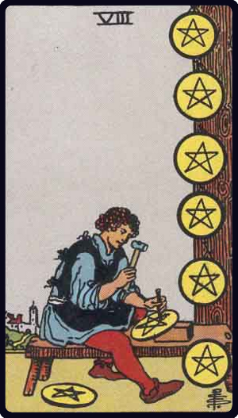

# Oito de Ouros

*Eight of Pentacles*

## Waite — descrição e simbolismo

An artist in stone at his work, which he exhibits in the form of trophies.

## Waite — significados

Work, employment, commission, craftsmanship, skill in craft and business, perhaps in the preparatory stage.

## Waite — invertida

Voided ambition, vanity, cupidity, exaction, usury. It may also signify the possession of skill, in the sense of the ingenious mind turned to cunning and intrigue.

## Waite — resumo

A young man in business who has relations with the Querent; a dark girl. Reversed. The Querent will be compromised in a matter of money-lending.

---

*Fontes: A. E. Waite, The Pictorial Key to the Tarot (1911), domínio público.*
