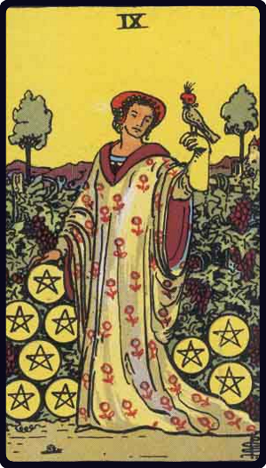

# Nove de Ouros

*Nine of Pentacles*

## Waite — descrição e simbolismo

A woman, with a bird upon her wrist, stands amidst a great abundance of grapevines in the garden of a manorial house. It is a wide domain, suggesting plenty in all things. Possibly it is her own possession and testifies to material well-being.

## Waite — significados

Prudence, safety, success, accomplishment, certitude, discernment.

## Waite — invertida

Roguery, deception, voided project, bad faith.

## Waite — resumo

Prompt fulfilment of what is presaged by neighbouring cards. Reversed.N ain hopes.

---

*Fontes: A. E. Waite, The Pictorial Key to the Tarot (1911), domínio público.*
