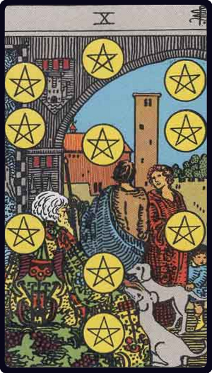

# Dez de Ouros

*Ten of Pentacles*

## Waite — descrição e simbolismo

A man and woman beneath an archway which gives entrance to a house and domain. They are accompanied by a child, who looks curiously at two dogs accosting an ancient personage seated in the foreground. The child's hand is on one of them.

## Waite — significados

Gain, riches; family matters, archives, extraction, the abode of a family.

## Waite — invertida

Chance, fatality, loss, robbery, games of hazard; sometimes gift, dowry, pension.

## Waite — resumo

Represents house or dwelling, and derives its value from other cards. Reversed. An occasion which may be fortunate or otherwise.

---

*Fontes: A. E. Waite, The Pictorial Key to the Tarot (1911), domínio público.*
