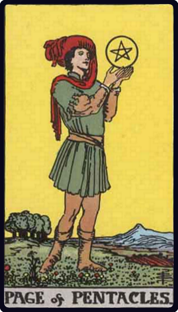

# Valete de Ouros

*Page of Pentacles*

## Waite — descrição e simbolismo

A youthful figure, looking intently at the pentacle which hovers over his raised hands. He moves slowly, insensible of that which is about him.

## Waite — significados

Application, study, scholarship, reflection another reading says news, messages and the bringer thereof; also rule, management.

## Waite — invertida

Prodigality, dissipation, liberality, luxury; unfavourable news.

## Waite — resumo

A dark youth; a young officer or soldier; a child. Reversed. Sometimes degradation and sometimes pillage.

---

*Fontes: A. E. Waite, The Pictorial Key to the Tarot (1911), domínio público.*
