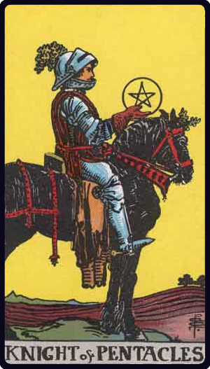

# Cavaleiro de Ouros

*Knight of Pentacles*

## Waite — descrição e simbolismo

He rides a slow, enduring, heavy horse, to which his own aspect corresponds. He exhibits his symbol, but does not look therein.

## Waite — significados

Utility, serviceableness, interest, responsibility, rectitude-all on the normal and external plane.

## Waite — invertida

inertia, idleness, repose of that kind, stagnation; also placidity, discouragement, carelessness.

## Waite — resumo

An useful man; useful discoveries. Reversed. A brave man out of employment.

---

*Fontes: A. E. Waite, The Pictorial Key to the Tarot (1911), domínio público.*
