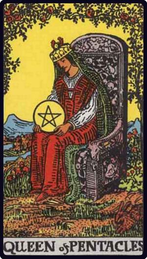

# Rainha de Ouros

*Queen of Pentacles*

## Waite — descrição e simbolismo

The face suggests that of a dark woman, whose qualities might be summed up in the idea of greatness of soul; she has also the serious cast of intelligence; she contemplates her symbol and may see worlds therein.

## Waite — significados

Opulence, generosity, magnificence, security, liberty.

## Waite — invertida

Evil, suspicion, suspense, fear, mistrust.

## Waite — resumo

Dark woman; presents from a rich relative; rich and happy marriage for a young man. Reversed. An illness.

---

*Fontes: A. E. Waite, The Pictorial Key to the Tarot (1911), domínio público.*
