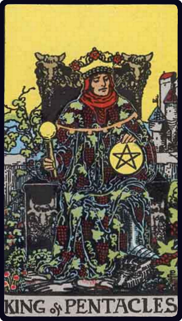

# Rei de Ouros

*King of Pentacles*

## Waite — descrição e simbolismo

The figure calls for no special description the face is rather dark, suggesting also courage, but somewhat lethargic in tendency. The bull's head should be noted as a recurrent symbol on the throne. The sign of this suit is represented throughout as engraved or blazoned with the pentagram, typifying the correspondence of the four elements in human nature and that by which they may be governed. In many old Tarot packs this suit stood for current coin, money, deniers. I have not invented the substitution of pentacles and I have no special cause to sustain in respect of the alternative. But the consensus of divinatory meanings is on the side of some change, because the cards do not happen to deal especially with questions of money.

## Waite — significados

Valour, realizing intelligence, business and normal intellectual aptitude, sometimes mathematical gifts and attainments of this kind; success in these paths.

## Waite — invertida

Vice, weakness, ugliness, perversity, corruption, peril.

## Waite — resumo

A rather dark man, a merchant, master, professor. Reversed. An old and vicious man.

---

*Fontes: A. E. Waite, The Pictorial Key to the Tarot (1911), domínio público.*
