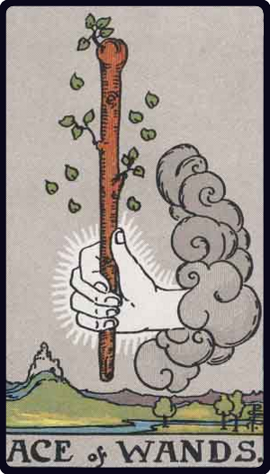

# Ás de Paus

*Ace of Wands*

## Waite — descrição e simbolismo

A hand issuing from a cloud grasps a stout wand or club.

## Waite — significados

Creation, invention, enterprise, the powers which result in these; principle, beginning, source; birth, family, origin, and in a sense the virility which is behind them; the starting point of enterprises; according to another account, money, fortune, inheritance.

## Waite — invertida

Fall, decadence, ruin, perdition, to perish also a certain clouded joy.

## Waite — resumo

Inflexible will, unalterable law. Reversed: Unexpected change of position.

---

*Fontes: A. E. Waite, The Pictorial Key to the Tarot (1911), domínio público.*
