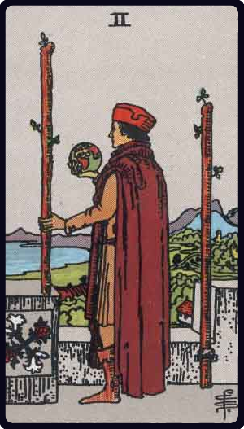

# Dois de Paus

*Two of Wands*

## Waite — descrição e simbolismo

A tall man looks from a battlemented roof over sea and shore; he holds a globe in his right hand, while a staff in his left rests on the battlement; another is fixed in a ring. The Rose and Cross and Lily should be noticed on the left side.

## Waite — significados

Between the alternative readings there is no marriage possible; on the one hand, riches, fortune, magnificence; on the other, physical suffering, disease, chagrin, sadness, mortification. The design gives one suggestion; here is a lord overlooking his dominion and alternately contemplating a globe; it looks like the malady, the mortification, the sadness of Alexander amidst the grandeur of this world's wealth.

## Waite — invertida

Surprise, wonder, enchantment, emotion, trouble, fear.

## Waite — resumo

Favourable in things of pleasure and business, as well as love; also wealth and honour. Reversed: Passion.

---

*Fontes: A. E. Waite, The Pictorial Key to the Tarot (1911), domínio público.*
