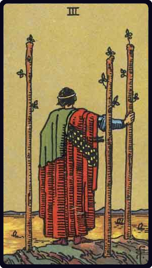

# Três de Paus

*Three of Wands*

## Waite — descrição e simbolismo

A calm, stately personage, with his back turned, looking from a cliffs edge at ships passing over the sea. Three staves are planted in the ground, and he leans slightly on one of them.

## Waite — significados

He symbolizes established strength, enterprise, effort, trade, commerce, discovery; those are his ships, bearing his merchandise, which are sailing over the sea. The card also signifies able co-operation in business, as if the successful merchant prince were looking from his side towards yours with a view to help you.

## Waite — invertida

The end of troubles, suspension or cessation of adversity, toil and disappointment.

## Waite — resumo

Unexpected advancement for a military man. Reversed: Consolation, cure, end of the business.

---

*Fontes: A. E. Waite, The Pictorial Key to the Tarot (1911), domínio público.*
